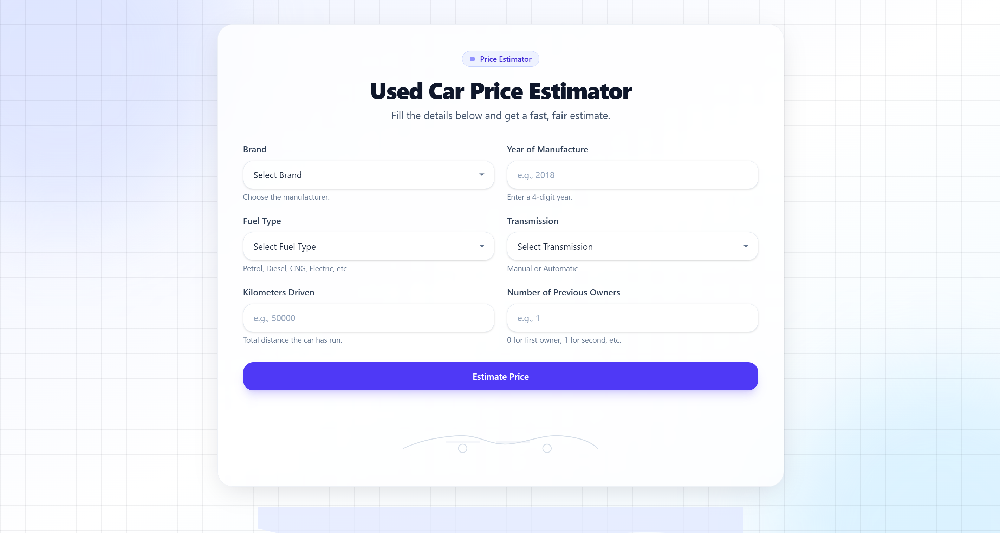
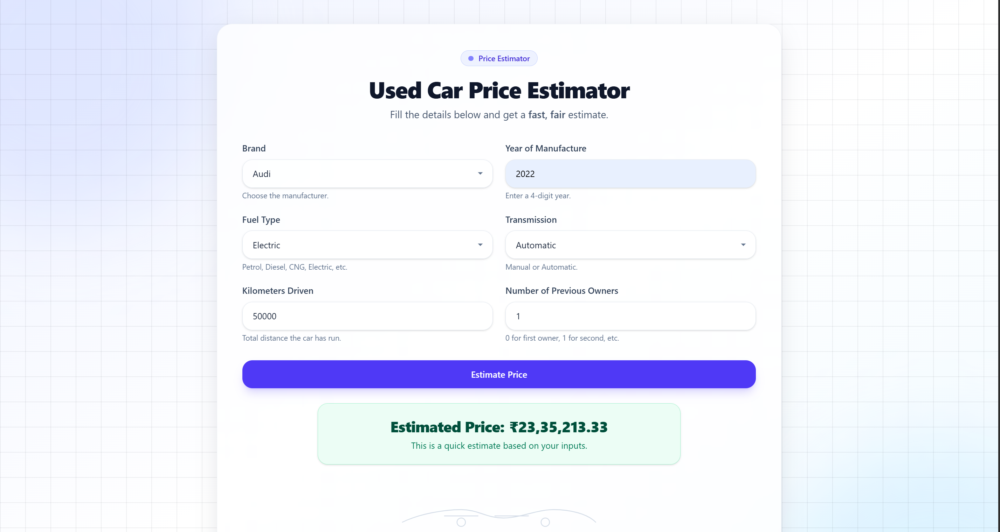

# Used Car Price Predictor

A web application that predicts the price of used cars based on key features such as brand, year of manufacture, fuel type, transmission type, kilometers driven, and the number of previous owners.  

The project uses a **Flask backend** with a pre-trained **machine learning model** and a **React frontend** for a modern, user-friendly experience.

---

## Features
- **Clean & Responsive UI** for entering car details.  
- **Dynamic loading** of car brands, fuel types, and transmission options from the backend.  
- **Real-time price estimation** using a trained ML model.  
- **User-friendly input fields & dropdowns** for seamless data entry.  

---

## Screenshots
**Main Interface:**


**Price Estimation Result:**



---

## 🛠️ Tech Stack

### Frontend
- ⚛️ React  
- 🎨 Tailwind CSS  

### Backend
- 🐍 Python (Flask)  
- 📦 Numpy & Pandas (data processing)  
- 🤖 Scikit-learn (machine learning model)  

---

## 📂 Project Structure
```

.
├── client/
│   ├── public/
│   └── src/
│       ├── components/
│       │   └── landing.jsx                 # Landing page component
│       │   └── estimate.jsx                # Main estimation page component
│       ├── App.jsx
│       └── main.jsx
├── server/
│   ├── artifacts/
│   │   ├── columns.json                    # Model columns
│   │   └── car_price_prediction.pickle     # Trained ML model
│   │   └── scaler.pickle                   # For scaling
│   ├── app.py                              # Flask server
│   └── util.py                             # Helper functions
└── README.md

````

---

## ⚙️ Setup and Installation

### Prerequisites
- Python **3.8+**  
- Node.js & npm  
- pip (Python package installer)  

---

### 1. Clone the Repository
```bash
git clone https://github.com/your-username/car-price-predictor.git
cd car-price-predictor
````

---

### 2. Backend Setup (Flask)

Navigate to the server directory:

```bash
cd server
```

Create and activate a virtual environment (recommended):

```bash
python -m venv venv
# On Linux/Mac
source venv/bin/activate
# On Windows
venv\Scripts\activate
```

Install dependencies:

```bash
pip install -r requirements.txt
```

Run the Flask server:

```bash
python app.py
```

Server will run on: **[http://127.0.0.1:5000](http://127.0.0.1:5000)**

---

### 3. Frontend Setup (React)

Open a new terminal and navigate to the client directory:

```bash
cd client
```

Install required npm packages:

```bash
npm install
```

Start the development server:

```bash
npm run dev
```

Frontend will run on: **[http://localhost:5173](http://localhost:5173)**

---

## 🚀 How to Use

1. Open the frontend in your browser (`http://localhost:5173`).
2. Fill in the car details:

   * Brand
   * Year of Manufacture
   * Fuel Type
   * Transmission
   * Kilometers Driven
   * Number of Previous Owners
3. Click **Estimate Price**.
4. The predicted price will appear below the form.